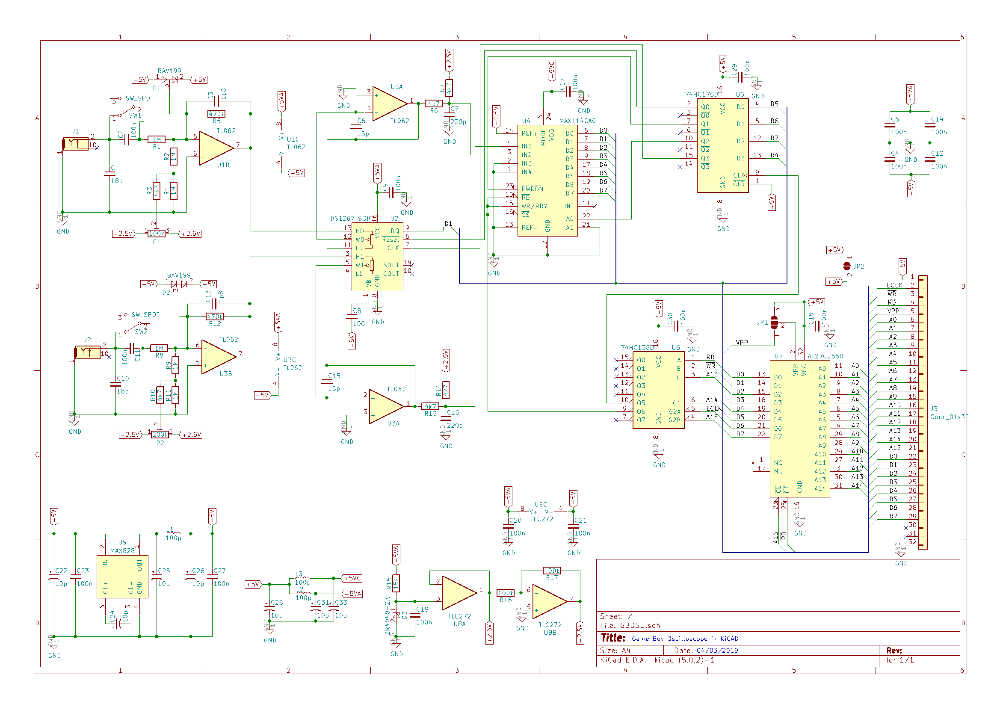
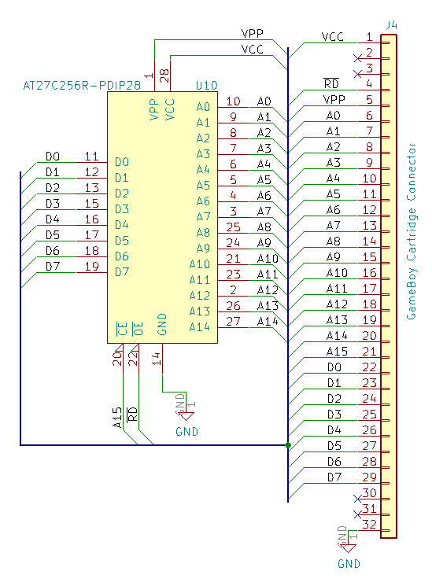
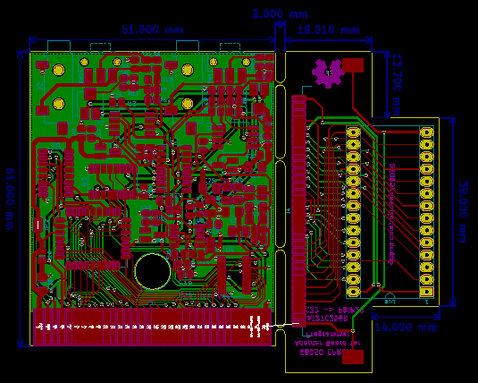
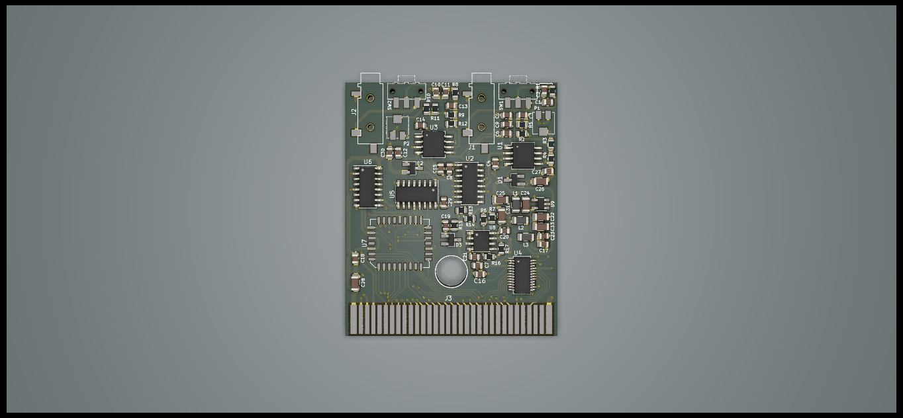
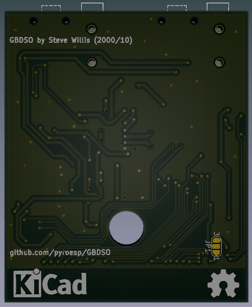

# GBDSO

GBDSO article : http://www.radanpro.com/Radan2400/TestShematics/GameBoyScope.pdf  
GBDSO BOM list (2019/02) : https://docs.google.com/spreadsheets/d/1vu9Xc1Mw5STfz_mAsAOrmmyRrHJMRS4_JKM7iif-KBE/edit#gid=0

## BOM list

|                       Label                        |               Value / Name               | Price per unit | Number | Total Price |                                                     Link                                                     |
|----------------------------------------------------|------------------------------------------|----------------|--------|-------------|--------------------------------------------------------------------------------------------------------------|
| R1, R2, R4, R8, R9, R11                                 | 1M                                       |           0.09 |      6 |        0.54 | https://www.digikey.be/product-detail/en/bourns-inc/CR0805-FX-1004ELF/CR0805-FX-1004ELFCT-ND/3740924         |
| R15                                                | 15k                                      |           0.09 |      1 |        0.09 | https://www.digikey.be/product-detail/en/bourns-inc/CR0805-FX-1502ELF/CR0805-FX-1502ELFCT-ND/3740926         |
| R5, R12                                             | 470k                                     |           0.09 |      2 |        0.18 | https://www.digikey.be/product-detail/en/RC0805FR-07470KL/311-470KCRCT-ND/730924/?itemSeq=284203171          |
| R3, R6, R7, R10, R13, R14                               | 4k7                                      |           0.09 |      6 |        0.54 | https://www.digikey.be/product-detail/en/CR0805-FX-4701ELF/CR0805-FX-4701ELFCT-ND/3925402/?itemSeq=284203192 |
| R16, R17                                            | 100k                                     |           0.09 |      2 |        0.18 | https://www.digikey.be/product-detail/en/yageo/RC0805FR-07100KL/311-100KCRCT-ND/730491                       |
| P1, P2                                              | 100k                                     |           0.24 |      2 |        0.48 | https://www.digikey.be/product-detail/en/bourns-inc/TC33X-2-104E/TC33X-104ECT-ND/612912                      |
| C1, C10                                             | 18p                                      |           0.12 |      2 |        0.24 | https://www.digikey.be/product-detail/en/yageo/CC0805JRNPO9BN180/311-1102-1-ND/303012                        |
| C2, C4, C5, C8, C9, C11, C12, C14, C17-C21, C23, C27, C29, C30 | 100n                                     |           0.09 |     17 |        1.53 | https://www.digikey.be/product-detail/en/CL21B104KBCNNNC/1276-1003-1-ND/3889089/?itemSeq=284204783           |
| C3, C13                                             | 1p8                                      |           0.09 |      2 |        0.18 | https://www.digikey.be/product-detail/en/samsung-electro-mechanics/CL21C1R8CBANNNC/1276-2599-1-ND/3890685    |
| C6, C15                                             | 15p                                      |            0.1 |      2 |         0.2 | https://www.digikey.be/product-detail/en/wurth-electronics-inc/885012007052/732-7847-1-ND/5454474            |
| C7, C16                                             | 220p                                     |           0.09 |      2 |        0.18 | https://www.digikey.be/product-detail/en/CL21B221KBANNNC/1276-2474-1-ND/3890560/?itemSeq=284205074           |
| C22, C24, C25, C26, C28, C31, C33                        | 10µ 16V                                  |           0.31 |      7 |        2.17 | https://www.digikey.be/product-detail/en/vishay-sprague/293D106X0016A2TE3/718-1956-1-ND/3985805              |
| L1, L2, L3                                           | 100µ                                     |           0.18 |      3 |        0.54 | https://www.digikey.be/product-detail/en/taiyo-yuden/LBM2016T101J/587-1817-1-ND/1465287                      |
| D1, D2                                              | BAV199                                   |           0.17 |      2 |        0.34 | https://www.digikey.be/product-detail/en/diodes-incorporated/BAV199-7-F/BAV199-FDICT-ND/1033647              |
| D3                                                 | ZR25D01 -> ZR40402F25TA                  |           0.61 |      1 |        0.61 | https://www.digikey.be/product-detail/en/diodes-incorporated/ZR40402F25TA/ZR40402F25TACT-ND/243209           |
| IC1, IC3                                            | MC33182D -> TL062IDT                     |           0.43 |      2 |        0.86 | https://www.digikey.be/product-detail/en/stmicroelectronics/TL062IDT/497-6763-1-ND/1865381                   |
| IC2                                                | DS1267S100 -> DS1267BS-100+              |           5.52 |      1 |        5.52 | https://www.digikey.be/product-detail/en/maxim-integrated/DS1267BS-100/DS1267BS-100-ND/5049982               |
| IC4                                                | MAX114CAG                                |            6.9 |      1 |         6.9 | https://www.digikey.be/product-detail/en/maxim-integrated/MAX114CAG/MAX114CAG-ND/1428095                     |
| IC5                                                | 74HC175D                                 |           0.41 |      1 |        0.41 | https://www.digikey.be/product-detail/en/texas-instruments/SN74HC175DR/296-14840-1-ND/562676                 |
| IC6                                                | 74HC138D                                 |           0.34 |      1 |        0.34 | https://www.digikey.be/product-detail/en/texas-instruments/SN74HC138D/296-1193-5-ND/277220                   |
| IC7                                                | AT27C256R-12JC -> AT27C256R-70JU         |            1.2 |      1 |         1.2 | https://www.digikey.be/product-detail/en/microchip-technology/AT27C256R-70JU/AT27C256R-70JU-ND/1008583       |
| IC8                                                | TLC27L2CD                                |           0.86 |      1 |        0.86 | https://www.digikey.be/product-detail/en/texas-instruments/TLC27L2CDR/296-1316-1-ND/404950                   |
| IC9                                                | MAX828EUK                                |            4.5 |      1 |         4.5 | https://www.digikey.be/product-detail/en/MAX828EUK%2bT/MAX828EUK%2bTCT-ND/2699369/?itemSeq=284207452         |
| S1, S2                                              | Slide switch 1 change-over contact |           0.49 |      2 |        0.98 | https://www.digikey.be/product-detail/en/c-k/JS102011SAQN/401-1999-1-ND/1640114                              |
| K1, K2                                              | 3.5mm stereo socket -> mono smd          |           0.88 |      2 |        1.76 | https://www.digikey.be/product-detail/en/cui-inc/MJ-3523-SMT-TR/CP-3523MJCT-ND/669691                        |

Total Price: 31.33€ 			
Total Components: 70

## Schematic

## PCB

 
  

<b>NOTE:</b>  
21/02/2019: Looks like I forgot to change the potentiometer footprint. The one I selected in the BOM list looks to be smaller than the current footprint. I'm hoping the pads are big enough because the PCBs have already been made.

## Programming the AT27C256R

05/03/2019: I've added two jumpers to the PCB so that the AT27C256R can be programmed from the cartridge.  
The first jumper JP1 selects either 5V to pin 2 (VPP) of the EPROM and VPP from the unused 5th edge connector.  

The second jumper JP2 cuts the power going to the rest of the board.  
While in programming mode, the EPROM needs 6.5V to VCC and I'd rather not have it power to the rest of the board.  

The EPROM should be able to be programmed through the edge connector with either a homemade programmer or an adapter board for an existing Universal Programmer (like the TL866 or other).  
Connections are as follows:  

|       Bus       |   GB Edge Connector   |   AT27C256R EPROM   | 
|-----------------|-----------------------|---------------------| 
|     Address     |        A0 - A14       |       A0 - A14      | 
|      Data       |        D0 - D7        |       D0 - D7       | 
|   Chip Enable   |          A15          |         /CE         | 
|  Output Enable  |          /RD          |         /OE         | 
|       Vcc       |          Vcc          |         Vcc         | 
|       Vpp       |          Vpp          |         Vpp         | 

### GBDSO EPROM to PDIP28

06/03/2019: I've added an adapter board to go from the EPROM on the GBDSO cart (PLCC32) to a PDIP28.  
See the datasheet of the EPROM for the connections.  

Any decent Universal Programmer should be able to program this now.  

You can see the adapter board on the 3D rendered board above.  

The footprint for the GameBoy connector is the DS Lite footprint made by Gekkio and is available here: <a href="https://github.com/Gekkio/gekkio-kicad-libs">gekkio-kicad-libs</a>  
Many thanks to Gekkio for the footprint.

Note: Not yet tested !  

## Original GBDSO

- Pictures courtesy of Tauwasser on the <a href="https://github.com/gbdev/awesome-gbdev">gbdev discord</a>.

## TODO

- Change potentiometer footprint to match BOM list component  
- Change orientation of potentiometer on PCB so both are the same